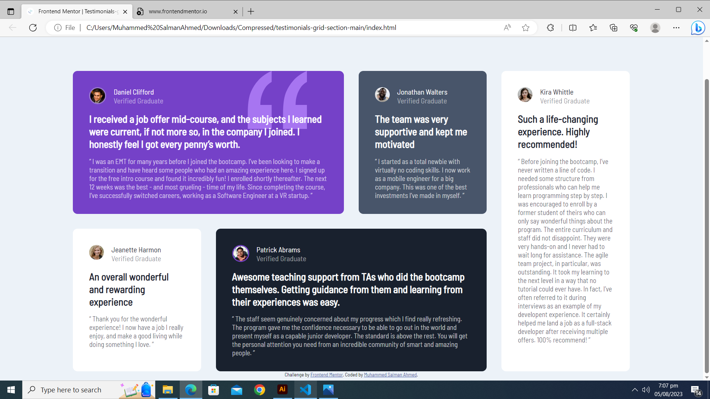

# Frontend Mentor - Testimonials grid section solution

This is a solution to the [Testimonials grid section challenge on Frontend Mentor](https://www.frontendmentor.io/challenges/testimonials-grid-section-Nnw6J7Un7). Frontend Mentor challenges help you improve your coding skills by building realistic projects. 

## Table of contents

- [Overview](#overview)
  - [Screenshot](#screenshot)
  - [Links](#links)
- [My process](#my-process)
  - [Built with](#built-with)
  - [What I learned](#what-i-learned)
  - [Continued development](#continued-development)
- [Author](#author)

## Overview

I built this testimonials grid section website using HTML and CSS on VS Code.

### Screenshot




### Links

- Solution URL: (https://github.com/MuhammedSalmanAhmed/QR-Code-Challenge-Frontend-Mentor)
- Live Site URL: (https://muhammedsalmanahmed.github.io/QR-Code-Challenge-Frontend-Mentor/)

## My process

Based on given design picture and style-guide. I applied CSS rules to index.html file to make it look as close as possible to result.

### Built with

- Semantic HTML5 markup
- CSS custom properties
- CSS grid

### What I learned

```css
.container{
    display: grid;
    grid-template-columns: 1fr 1fr 1fr 1fr;
    grid-template-rows: 1fr 1fr;
    row-gap: 2rem;
    column-gap: 2rem;
.picture{
    border-radius: 50%;
.Review2{
    opacity: 70%;
```

### Continued development

I would like to improve my concept of margins, padding, grids and positioning more.

## Author

- Website - [Muhammed Salman Ahmed](https://muhammedsalmanahmed.github.io/CV-CSS/)
- Frontend Mentor - [@MuhammedSalmanAhmed](https://www.frontendmentor.io/profile/MuhammedSalmanAhmed)
- Facebook - [Muhammed Salman Ahmed](https://www.facebook.com/profile.php?id=100075963945987)